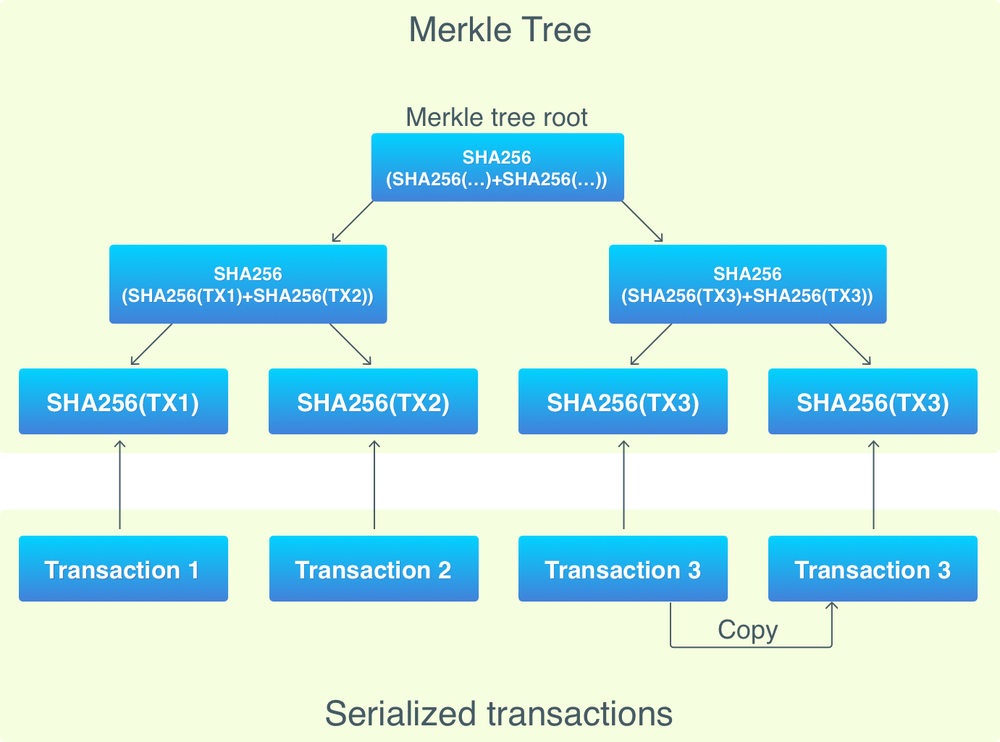

# Part Six
[building-blockchain-in-go Part 6 Transactions 2](https://jeiwan.cc/posts/building-blockchain-in-go-part-6/)

本系列最开始的时候，我们介绍到，区块链是一个分布式的数据库结构。
那个时候，我们忽略了"分布式"的部分，而将关注点放在"数据库"的概念上。
目前为止，我们已经实现了区块链数据库相关的近乎所以的特性，下面就将介绍一些被我们跳过的机制。
再下一章介绍区块链的分布式的属性。

# 奖励机制（Reward）
挖矿会得到奖励，这个奖励其实就是 Coinbase transaction。
Coinbase transaction的输出只包含了矿工的公钥哈希值。

```
func (cli *CLI) send(from, to string, amount int) {
    ...
    bc := NewBlockchain()
    UTXOSet := UTXOSet{bc}
    defer bc.db.Close()

    tx := NewUTXOTransaction(from, to, amount, &UTXOSet)
    cbTx := NewCoinbaseTX(from, "")
    txs := []*Transaction{ctTx, tx}

    newBlock := bc.MineBlock(txs)
    fmt.Println("Success!")
}
```

这意味着，挖一个新区块，会获得奖励；基于原有的交易，为了生成一次新的交易而产生的区块，也会获得奖励。


# The UTXO Set
第三章持久化那里，我们学习了比特币是如何把区块存储在数据库里的。
其中区块存储于 "blocks" 数据库，交易的输出存储于 chainstate 数据库。

`chainstate`的结构如下：
>1. 'c' + 32-byte transaction hash -> unspent transaction output record for that transaction
2. 'B' -> 32-byte block hash: the block hash up to which the database represents the unspent transaction outputs

chainstate 并不存储交易，而是存储 UTXO set，也就是 unspent transaction outputs。
此外，它也存储了"the block hash up to which the database represents the unspent transaction outputs"，
也就是"未使用的交易输出对应的区块的哈希值"。（下一章节会实现这个特性）

为什么要存储 UTXO set 呢？因为我们在 FindUnspentTransactions 的时候是遍历了所有的区块。性能是个问题！！
```
func (bc *Blockchain) FindUnspentTransactions(pubKeyHash []byte) []Transaction {
    ...
    bci := bc.Iterator()

    for {
        block := bci.Next()

        for _, tx := range block.Transactions {
            ...
        }

        if len(block.PrevBlockHash) == 0 {
            break
        }
    }
    ...
}
```

这意味着，必须遍历整个节点来验证交易的合法性。而且，校验交易需要夸区块进行。

所以，UTXO set会放入缓存，从而用于计算余额和校验交易。
>截止到2017.09，总共有 485，860个区块，140+ Gb的数据库存储空间，2.7Gb的UTXO set。

在改进 UTXO 之前，先回顾一下原先我们实现查找交易的方法：

1. Blockchain.FindUnspentTransactions – the main function that finds transactions with unspent outputs.
It’s this function where the iteration of all blocks happens.
2. Blockchain.FindSpendableOutputs – this function is used when a new transaction is created.
If finds the enough number of outputs holding required amount.
3. Blockchain.FindUTXO – finds unspent outputs for a public key hash, used to get balance.
4. Blockchain.FindTransaction – finds a transaction in the blockchain by its ID.
It iterates over all blocks until finds it.

所有的这些方法都会遍历数据库里的所有区块。需要注意的是，我们无法改进上面所有的方法。
因为UTXO只是未使用的交易，无法代表所有的交易，所以 `FindTransaction` 还得是原来的逻辑 - 遍历所有。

改进后：
1. Blockchain.FindUTXO - finds all unspent outputs by iterating over blocks.
2. UTXOSet.Reindex - uses FindUTXO to find unspent outputs, and stores them in a db.
This is where caching happens.
3. UTXOSet.FindSpendableOutputs - analog of `Blockchain.FindSpendableOutputs`, but uses UTXO set.
4. UTXOSet.FindUTXO - analog of `Blockchain.FINDUTXO`, but uses UTXO set.
5. Blockchain.FindTransaction remains the same.

下面开始介绍 UTXO set：
```
type UTXOSet struct {
    Blockchain *Blockchain
}

func (u UXTOSet) Reindex() {
    db := u.Blockchain.db
    bucketName := []byte(uxtoBucket)

    err := db.Update(func(tx *bolt.Tx) error {
        err := tx.DeleteBucket(bucketName)
        _, err = tx.CreateBucket(bucketName)
    })

    UTXO := u.Blockchain.FindUTXO()

    err = db.Update(func(tx *bolt.Tx) error {
        b := tx.Bucket(bucketName)

        for txID, outs := range UTXO {
            key, err := hex.DecodeString(txID)
            err = b.Put(key, outs.Serialize())
        }
    })
}
```

`Reindex`方法先删除bucket（表），再从blockchain里获取所有未使用的输出，再保存到bucket里。

`Blockchain.FindUTXO` 和 `Blockchain.FindUnspentTransactions` 几乎是一样的。
除了它返回的是一个字典 - TransactionID => TransactionOutputs。

基于 FindUTXO 就可以去实现 `FindSpendableOutputs` 和 `FindUTXO` 了。

现在拥有了 UTXO 后，我们的数据（交易）就分在两个存储里：
1. actual transactions stored in the blockchain
2. unspent outputs stored in the UTXO set

这就要求我们必须保障二者数据的同步。我们既需要UTXO能够实时更新，有不希望没增加一个block就做一次Reindex。
那样就太频繁了。因此，我们需要一个 Update UTXO set 的机制：
```
func (u UTXOSet) Update(block *Block) {
    db := u.Blockchain.db

    err := db.Update(func(tx *bolt.Tx) error {
        b := tx.Bucket([]byte(utxoBucket))

        for _, tx := range block.Transactions {
            if tx.IsCoinbase() == false {
                for _, vin := range tx.Vin {
                    updatedOuts := TXOutputs{}
                    outsBytes := b.Get(vin.Txid)
                    outs := DeserializeOutputs(outsBytes)

                    for outIdx, out := range outs.Outputs {
                        if outIdx != vin.Vout {
                            updatedOuts.Outputs = append(updatedOuts.Outputs, out)
                        }
                    }

                    if len(updatedOuts.Outputs) == 0 {
                        err := b.Delete(vin.Txid)
                    } else {
                        err := b.Put(vin.Txid, updatedOuts.Serialize())
                    }
                }
            }

            newOutputs := TXOutputs{}
            for _, out := range tx.Vout {
                newOutputs.Outputs = append(newOutputs.Outputs, out)
            }

            err := b.Put(tx.ID, newOutputs.Serialize())
        }
    })
}
```
(意思就是，不要全量的Reindex，而是直接Update)

那么Reindex只发生在新建一个区块链的时候，新加一个区块的时候使用的是Update方法。
虽然新建一个区块链的时候，也可以使用Update方法，但是我们先保留Reindex机制，因为后面会用到。

```
func (cli *CLI) sned(from, to string, amount int) {
    ...
    newBlock := bc.MinBlock(txs)
    UTXOSet.Update(newBlock)
}
```

# Merkle Tree
除了上面奖励机制、缓存未使用的交易输出的机制，本章节还将介绍一个优化的机制。

>难题：
区块链是去中心化的，意味着所有节点都要存储完整的交易+区块信息（140+Gb）。节点的责任包括校验交易和区块。
而且为了和其他节点交互以及下载新的区块，需要大量的网络带宽资源。

在中本聪的比特币白皮书里，他提出了一个解决方案：Simplified Payment Verification (SPV).

SPV是一个轻量级的比特币节点，它并不会下载整个区块链，更*不会对区块和交易进行校验*。
而相反，它会在区块里查找交易（目的是为了校验支付），同时关联到一个正常的节点上来下载需要的数据。

这样的机制允许一个full node带上多个light wallet nodes。
为了实现SPV，需要有一种在不下载整个区块副本的前提下，能够检查某个区块中是否包含特定交易的方法。
*Merkle Tree*就是一种能够提供这种方法的数据结构。



这里要注意：如果有奇数个交易，那么最后一个交易会重复一下（只是Merkle Tree里重复）。
从下往上，叶子节点会成对出现，它们的哈希值会串接起来，然后再哈希（两个变一个），哈希后的结果再串接、再哈希（还是每两个变一个），
最终得到了一个根节点 - Merkle Tree Root。The root of tree。

最终的这个根节点的哈希值，就代表了下方的所有交易数据。从而被存储在区块的头部（block headers），然后PoW里会用到它。

这样做的好处是：
不需要下载整个区块，而是只需要交易的哈希值、Root哈希值、Merkle路径，就可以对区块里的交易进行校验了。
代码如下：
```
type MerkleTree struct {
    RootNode *MerkleNode
}

type MerkleNode struct {
    Left    *MerkleNode
    Right   *MerkleNode
    Data    []byte
}
```
典型的树状结构！
新建一个Merkle Node
```
func NewMerkleNode(left, right *MerkleNode, data []byte) *MerkleNode {
    mNode := MerkleNode{}

    if left == nil && right == nil {
        hash := sha256.Sum256(data)
        mNode.Data = hash[:]
    } else {
        prevHashes := append(left.Data, right.Data...)
        hash := sha256.Sum256(prevHashes)
        mNode.Data = hash[:]
    }

    mNode.Left = left
    mNode.Right = right

    return &mNode
}
```
新建一个Merkle Tree
```
func NewMerkleTree(data [][]byte) *MerkleTree {
    var nodes []MerkleNode

    if len(data)%2 != 0 {
        data = append(data, data[len(data)-1])
    }

    for _, datum := range data {
        node := NewMerkleNode(nil, nil, datum)
        nodes = append(nodes, *node)
    }

    for i := 0; i < len(data)/2; i++ {
        var newLevel []MerkleNode

        for j := 0; j < len(nodes); j += 2 {
            node := NewMerkleNode(&nodes[j], &nodes[j+1], nil)
            newLevel = append(newLevel, *node)
        }

        nodes = newLevel
    }

    mTree := MerkleTree{&nodes[0]}

    return &mTree
}
```
先保证数据是偶数个，然后根据这些数据新建一个个的Node，并保存在一个数组里；
根据这个数组，生成上一层的Node数组，然后再根据新的Node数组，生成再上一层的Node数组，
直到最后只剩下一个Node，也就是Root Node。
>上面的代码有一个细节处理的很好：最底层的transaction需要补成偶数个，却不需要补成偶数个。
>通过对 i 的控制，可以避免 j+1 的越界。
>比如初始数据个数为10，新建的Node数组长度为5，那么对于变量j来说，可以取0，2，4这三个值，
>当j=4的时候，&node\[j+1\]就越界了，但是因为 i 只能取 0，1，所以避免了 j=4 的发生。

新建了Merkle Tree之后，就可以优化 PoW 的代码了。
```
func (b *Block) HashTransactions() []byte {
    var transactions [][]byte

    for _, tx := range b.Transactions {
        transactions = append(transactions, tx.Serialize())
    }
    mTree := NewMerkleTree(transactions)

    return mTree.RootNode.Data
}
```

# P2PKH
再一个需要详细介绍的概念。

比特币里有一种脚本语言，用来给交易的输出加锁；交易的输入里会进行解锁。
这种语言的语法很简单：
```
5 2 OP_ADD 7 OP_EQUAL
```

上面的命令不解释了，下面看一下比特币中用于支付的脚本：
```
<signature> <pubKey> OP_DUP OP_HASH160 <pubKeyHash> OP_EQUALVERIFY OP_CHECKSIG
```
这个脚本被称为*Pay to Public Key Hash (P2PKH)*。

***这是比特币支付的最核心机制！！！***

这个脚本分为两个部分，分别存储在两个不同的地方：
1. 第一部分，<signature><pubKey>，存储在输入的 ScriptSig里
2. 第二部分，OP_DUP OP_HASH160 <pubKeyhash> OP_EQUALVERIFY OP_CHECKSIG存储在输出的 ScriptPubKey里

因此，输出里包含了解锁的逻辑，输入里则提供了可以解锁输出的数据。执行该脚本：
1. Stack: empty;
Script: <signature> <pubKey> OP_DUP OP_HASH160 <pubKeyHash> OP_EQUALVERIFY OP_CHECKSIG
2. Stack: <signature>;
Script: <pubKey> OP_DUP OP_HASH160 <pubKeyHash> OP_EQUALVERIFY OP_CHECKSIG
3. Stack: <signature> <pubKey>;
Script: OP_DUP OP_HASH160 <pubKeyHash> OP_EQUALVERIFY OP_CHECKSIG
4. Stack: <signature> <pubKey> <pubKey>;
Script: OP_HASH160 <pubKeyHash> OP_EQUALVERIFY OP_CHECKSIG
5. Stack: <signature> <pubKey> <pubKeyHash>;
Script: <pubKeyHash> OP_EQUALVERIFY OP_CHECKSIG
6. Stack: <signature> <pubKey> <pubKeyHash> <pubKeyHash>;
Script: OP_EQUALVERIFY OP_CHECKSIG
7. Stack: <signature> <pubKey>;
Script: OP_CHECKSIG
8. Stack: true or false. Script: empty.

这里检查两个地方，一个是 OP_EQUALVERIFY <pubKeyHash>；一个是 OP_CHECKSIG <signature> <pubKey>

# 总结
目前为止，我们实现了区块链，地址，挖矿，交易。
但是还有一件重要的事情 - 共识（consensus）。正是"共识"，使得比特币成为了一个全球化的系统。

下一章节，我们将会实现区块链中的"去中心化"概念！


# 特别注意
utxo_set.go 文件里的多个方法都进行了数据库相关的操作：
```
db := u.Blockchain.db
db.Update()
...
```
但是这里不能写 `defer db.Close()`，否则的话，会出现以下错误：
```
panic: database not open
```